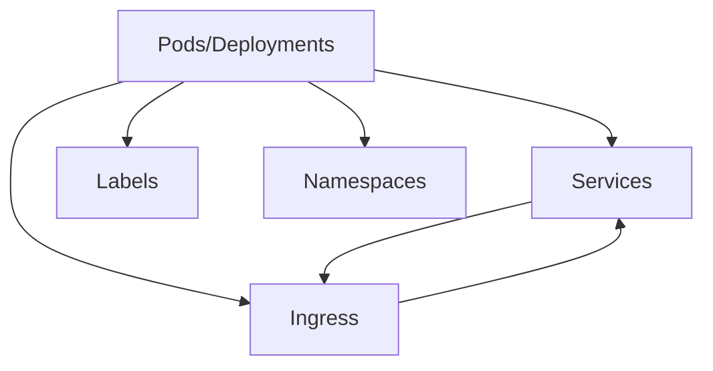

# Training exercise 1 - Fundamentals

## Concepts 'n' parts
### Discussion and description

From a conceptual point of view, describe what each the below parts are.

- Pod/Deployments
  - **Pod:** The smallest deployable units in Kubernetes, consisting of one or more containers, storage resources, a unique network IP, and options defining how the containers should run.
  - **Deployment**: A higher-level abstraction that manages a set of identical pods, ensuring that they are running and healthy, and providing features for updating and scaling the pods.
- Services
 - **Services** provide network connectivity to a set of pods, enabling load balancing and service discovery within a Kubernetes cluster. They allow pods to communicate with each other and with external clients.

- Ingress
  - **Ingress** exposes HTTP and HTTPS routes from outside the Kubernetes cluster to services within the cluster. It acts as a layer 7 (HTTP/HTTPS) load balancer, allowing inbound traffic to reach the appropriate services based on rules defined by the user.
- Labels
  - **Labels** are key-value pairs attached to Kubernetes objects (such as pods, deployments, and services) for identification, selection, and grouping purposes. They provide metadata that can be used for querying and organizing resources.
- Namespaces
  - **Namespaces** are virtual clusters within a Kubernetes cluster, used to partition resources and provide isolation between multiple users or teams. They enable logical separation of resources and help in organizing and managing Kubernetes objects.


### Diagram

Create a diagram and depict each of the previous mentioned parts and how they are related. 


# Training exercise 2 - Single Application
## Intro

In the exercise in the previous lecture, we utilized the imperitive style. Its
relatively simple and gets the job done. However using the desclarative style
using yaml files provides for a better approach both in terms of overview
describing the setup and ensuring that the description is versionen.

The goal of the exercise is to _nginxdemos/hello_, again as used in the previous
lecture, however this time you will write the needed yaml files such that upon
completion of the exercise you will be able to go to the web page
http://mycluster.my/hello and access it.

Do note that the associated slides describe a similar setup in-depth and thus
seeking inspiration from here is a prudent approach.

## Deployment
### Create

Create a deployment using _nginxdemos/hello_ as the image. The number of
replicas should 3. Note what the container port is. Have to remember that for
the next exercise.

#### Things to remember and heed

- Specifying _kind_ and _spec_
- What are labels for?
- What is the difference between _Deployment_ and _Pod_?
- Where do you find the _Pod_ specification?

  >The specification for Pods can be found within the spec section of Kubernetes YAML manifests. Each Pod specification includes details such as the container image, ports, volumes, and environment variables required for running the containers.

- How do you denote the cobling between the two and why is this particular important?
  >The coupling between a Deployment and Pods is denoted through labels and selectors. In the Deployment YAML manifest, the selector field specifies a set of labels used to match Pods managed by the Deployment. These labels are also defined within the Pod template. This coupling is important because it enables the Deployment to manage and control a specific set of Pods based on their labels. It allows for dynamic scaling, rolling updates, and easy management of Pod lifecycles. Additionally, labels facilitate service discovery and load balancing by enabling Services to select Pods based on their labels

- What is the difference between _replicas_ and _Pods_?
  >Replicas refer to the number of identical Pods that should be running at any given time. Pods are the smallest deployable units in Kubernetes, each representing a single instance of an application. Replicas are used to scale the number of Pods up or down based on the desired state defined in the Deployment configuration. By specifying the number of replicas, you can ensure that the desired number of Pods are running to handle incoming traffic and provide high availability.

- What is the difference between _Deployment_ and _Service_?
  >Deployments manage the lifecycle of Pods, ensuring that a specified number of identical Pods are running and healthy. Services provide network connectivity to a set of Pods, enabling load balancing and service discovery within a Kubernetes cluster. While Deployments manage the creation, scaling, and updating of Pods, Services provide a stable endpoint for accessing the Pods and distributing traffic among them.


### Apply

Use kubectl to apply the file content with your newly created _Deployment_.
```bash
kubectl apply -f deployment.yaml
```


### Accessing

Using _OpenLens_, select your local cluster and find the _Deployment_. In this
section you will find the _Pods_ associated. Click and find the option to
_port-forward_. 

Verify using your web browser that you in fact have access to the newly created
_Pod_.

How many of the _Pods_ do you have access to at a time, when utilizing this approach?

## Service

### Create

The next step is obviously creating a service to access our _Deployment_ and thus our _Pods_. 

#### Things to remember and heed

- Specifying _kind_ and _spec_
- How do you specify which _Pod_ it actually handles?
- Why is the _ports_ very important - e.g. what does it do?
- Which _type_ did you select? Which is default?

### Apply

Use kubectl to apply the file content with your newly created _Service_.
```bash	
kubectl apply -f service.yml
```

### Accessing

This time, while using _OpenLens_, find the "Section" called "Services" and
_port-forward_ to the service.


## Ingress

### Prepare your host machine ...

#### Installation

As stated in the exercise from the last exercise, you do _not_ have an ingress
controller handling incoming requests. This needs to be fixed. Ensure that it's
your cluster that is currenct.

There numerous different ways of installing applications or rather objects in
your cluster. One is _helm_ a package manager done using _helm charts_. _Helm_
is already installed via _Rancher Desktop_, however the _bitname_ package
repository needs to be installed. This is where we will install our _nginx_
server - our _ingress controller_. 

First add the _bitnami_ repository

> helm repo add bitnami https://charts.bitnami.com/bitnami

Secondly update it, meaning fetch the inventory and thus ensuring that our view is up to date.

> helm repo update

Lastly install the nginx server - e.g. our _ingress controller_. In simplified
terms, it routes all our incoming "web".

> helm install nginx --create-namespace -n ingress-nginx bitnami/nginx-ingress-controller

#### Ingress hostname

In order for our _Ingress_ controller to work with the hostname http://mycluster.my it has to know it. This can be done either by changing a DNS server or, in a hacky simple way by adding an entry to the file:

- On Windows
  - _/mnt/c/Windows/System32/drivers/etc/hosts_ (might be c: etc instead and you _must_ be admin!!)
- On Linux/Mac
  - _/etc/hosts_

The entry being

> 127.0.0.1 mycluster.my

### Create

Create an _Ingress_ object where the path should be _/hello_.

#### Things to remember and heed

- Specifying _kind_ and _spec_
- Why is it important to state "Ingress class" in the metadata of the _Ingress_
  object?
  >Specifying the Ingress class ensures that the Ingress controller associated with the specified class processes the Ingress rules. This is crucial in environments where multiple Ingress controllers are deployed, ensuring that the correct controller handles the Ingress configuration. By defining the Ingress class, you can direct traffic to the appropriate controller based on the class name.

- Why do you need to specify the hostname? What is it used for and can you think
  of other siuations where this could be cool?
  >The hostname is used to match incoming requests to the appropriate Ingress rules based on the requested domain. This allows you to host multiple applications on the same cluster, each accessible via different hostnames. Other situations where this could be useful include setting up virtual hosting for multi-tenant applications or implementing a blue-green deployment strategy with different hostnames for each version.

- The path is denoted to be _/hello_, this means that its passed on as-is. 
  - It this always desirable?
  - Can this be changed and if so how? (just the conclusion)

   > The specified path ("/hello") is passed as-is to the backend service. Whether it's desirable depends on the application's requirements. If the application expects requests to be routed to a specific path, then specifying it is necessary. However, if the application can handle requests at any path, you can use a wildcard path or remove the path specification altogether. To change the path, simply modify the path field in the Ingress rule.
  
- At what port is the cluster @ mycluster.my accessible? Normally it would be _80_, but that is not the case here! 
  - Why is that and where was this decided?
  - What is the actual port for _http_?
    >In this case, the Ingress controller is configured to use a non-standard port for HTTP traffic, it is ``port 57727``. This decision could be made based on security considerations or existing network configurations. The actual port for HTTP traffic is determined by the configuration of the Ingress controller. we can find the configured port in the Ingress controller's configuration or documentation.

### Apply

Use kubectl to apply the file content with your newly created _Ingress_.


### Accessing

If you have done everything correctly at this point, then opening your browser
at http://mycluster:8080/hello should direct you to the newly created application via
the _Ingress_ through the _Service_ unto the(a) _Pod_ itself.

Note that refreshing the page changes a specific detail on the page. Why, what
happens?
  >Because the NGINX Ingress controller distributes incoming requests among the backend pods, and each refresh may result in a different backend pod being selected to handle the request. As a result, the IP address and hostname of the backend server displayed on the page may change accordingly. This behavior is part of the load balancing and scaling capabilities provided by Kubernetes and the NGINX Ingress controller.

# Training exercise 2 - Namespace

## Prepare

Start by removing your existing application ensuring that your cluster is
somewhat empty.

## Create

Create a yaml file containing the creation of a namespace. Choose some name you
find fitting.

Add the namespace specifier to each and every kubernetes object you created in the
previous exercise.

### Apply

Use kubectl to apply the file content with your newly created _Ingress_.


### Verify and access

Verify using _OpenLens_ that the objects are placed in the namespace as planned.


Access the web again using your browser thus ensuring that the setup still
works.
